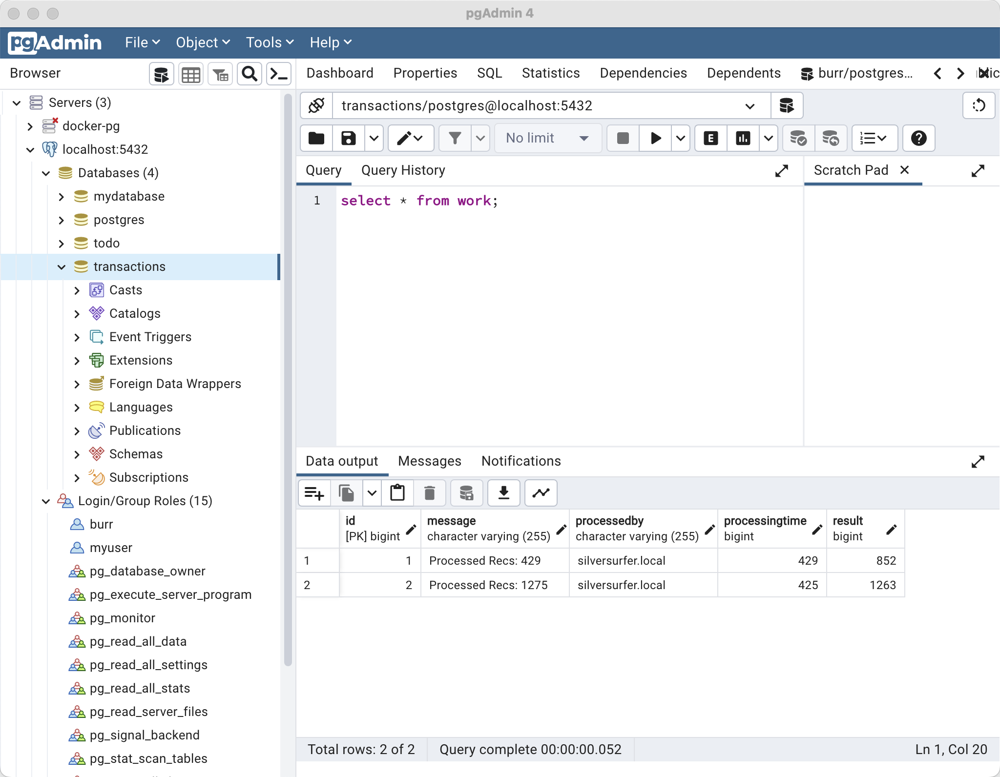
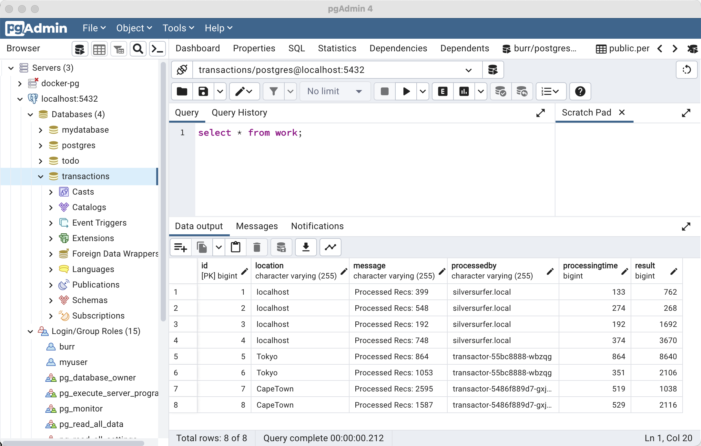
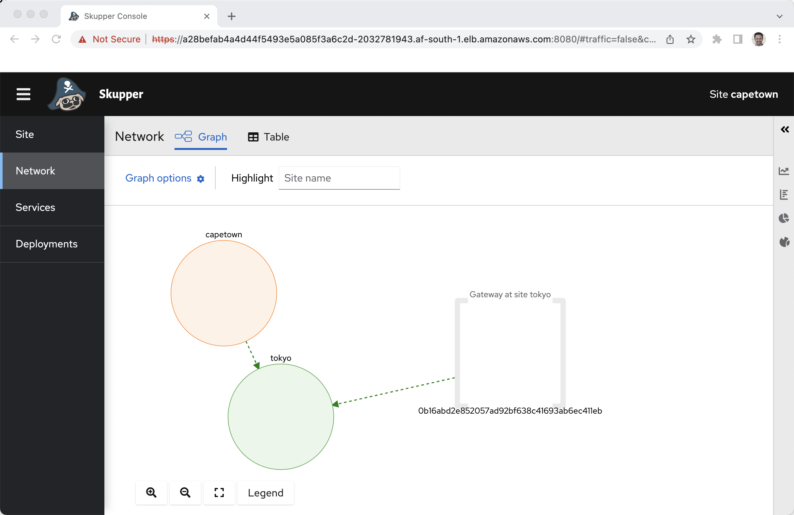
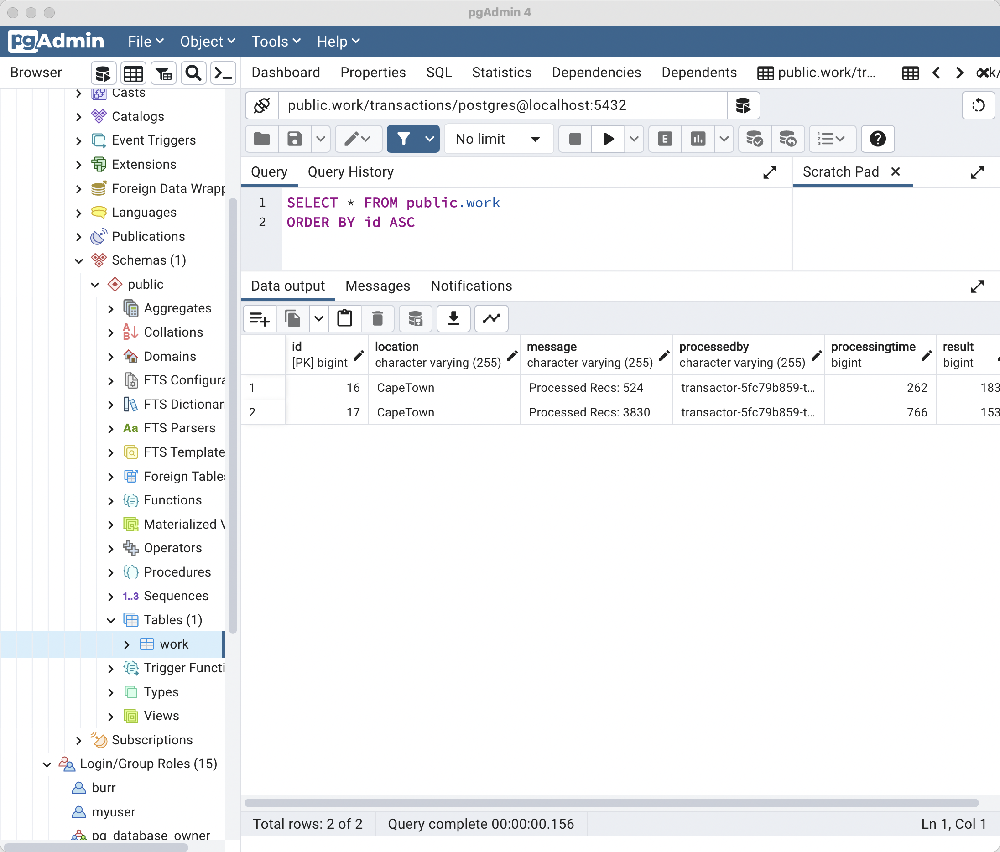
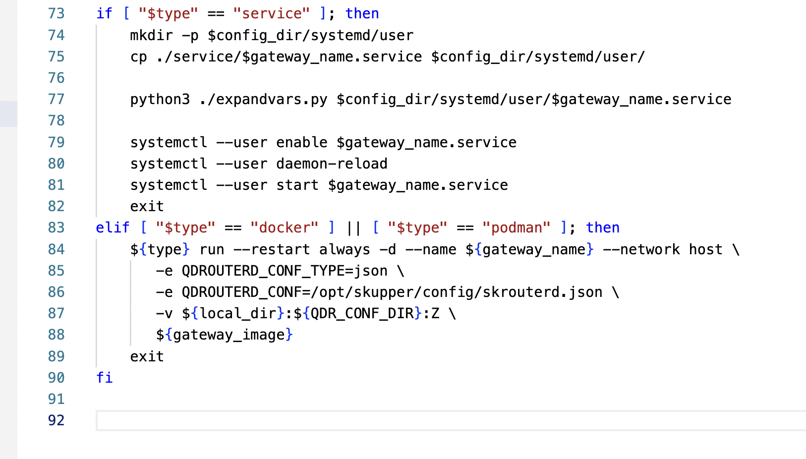
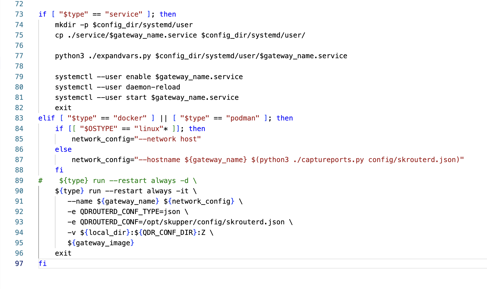
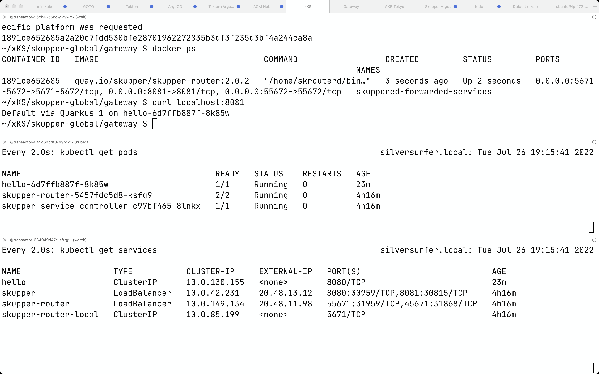

## On Cluster (KUBECONFIG)

This creates an AKS in Japan but any OpenShift or Kubernetes cluster would work

#### Create Cluster

```
export KUBECONFIG=/Users/burr/xKS/.kubeconfig/aks-tokyo-config

az login

az group create --name myAKSTokyoResourceGroup --location japaneast

az aks create --resource-group myAKSTokyoResourceGroup --name tokyo -s Standard_DS3_v2 --node-count 2
```

#### Update your KUBECONFIG

```
az aks get-credentials --resource-group myAKSTokyoResourceGroup --name tokyo --file $KUBECONFIG --overwrite
```

```
kubectl get nodes
NAME                                STATUS   ROLES   AGE     VERSION
aks-nodepool1-11151165-vmss000000   Ready    agent   7m32s   v1.22.11
aks-nodepool1-11151165-vmss000001   Ready    agent   7m30s   v1.22.11
```

#### Create Namespace

```
kubectl create namespace oltp
kubectl config set-context --current --namespace=oltp
```

#### Skupper ClI 

https://github.com/skupperproject/skupper/releases/

```
skupper version
client version                 1.0.2
```

#### Deploy Skupper

There is also a [Yaml way] (https://github.com/burrsutter/gke-skupper#yaml-way)and ArgoCD way [ArgoCD way] (https://github.com/burrsutter/gke-skupper#argocd-way) to deploy Skupper but for now I will use the CLI

https://github.com/burrsutter/gke-skupper


```
skupper init --site-name tokyo
```

```
kubectl get services
NAME                   TYPE           CLUSTER-IP    EXTERNAL-IP     PORT(S)                           AGE
skupper                LoadBalancer   10.0.50.0     20.27.186.231   8080:31618/TCP,8081:30211/TCP     97s
skupper-router         LoadBalancer   10.0.219.23   20.27.186.161   55671:32425/TCP,45671:32565/TCP   113s
skupper-router-local   ClusterIP      10.0.57.212   <none>          5671/TCP                          113s
```

```
kubectl get pods
NAME                                          READY   STATUS    RESTARTS   AGE
skupper-router-7f64947c99-qs987               2/2     Running   0          2m4s
skupper-service-controller-6458b58cc5-r2hwb   1/1     Running   0          98s
```

```
skupper status
```

```
Skupper is enabled for namespace "oltp" in interior mode. It is not connected to any other sites. It has no exposed services.
The site console url is:  https://20.27.186.231:8080
The credentials for internal console-auth mode are held in secret: 'skupper-console-users'
```

## Expose on-premises services

```
docker ps
CONTAINER ID   IMAGE     COMMAND   CREATED   STATUS    PORTS     NAMES
```

Gateway launch on localhost/laptop

```
skupper gateway init --config skuppered-services.yaml --type docker 
```

Create the proxy Kubernetes Services that will actually be implmented on-premises/on-laptop as they will have been Skupper'ized

```
skupper service create oltp-rdbms 5432
skupper service create on-prem-app 8080 --mapping http
```

```
kubectl get services
NAME                   TYPE           CLUSTER-IP     EXTERNAL-IP     PORT(S)                           AGE
oltp-rdbms             ClusterIP      10.0.8.159     <none>          5432/TCP                          10s
on-prem-app            ClusterIP      10.0.244.222   <none>          8080/TCP                          6s
skupper                LoadBalancer   10.0.50.0      20.27.186.231   8080:31618/TCP,8081:30211/TCP     5m41s
skupper-router         LoadBalancer   10.0.219.23    20.27.186.161   55671:32425/TCP,45671:32565/TCP   5m57s
skupper-router-local   ClusterIP      10.0.57.212    <none>          5671/TCP                          5m57s
```

```
skupper status
Skupper is enabled for namespace "oltp" in interior mode. It is connected to 1 other site. It has 2 exposed services.
The site console url is:  https://20.27.186.231:8080
The credentials for internal console-auth mode are held in secret: 'skupper-console-users'
```

```
skupper service status
Services exposed through Skupper:
├─ on-prem-app (http port 8080)
╰─ oltp-rdbms (tcp port 5432)
```

## On Cluster Tests

Using the Skupper Router pod but any pod should work as they all have visbility to Kubernetes Services in this hybrid namespace.

```
kubectl exec -it deploy/skupper-router -c router -- bash
```

```
curl on-prem-app:8080
Give me a number
```

```
curl on-prem-app:8080/2
Jobs: 2
```

And check your local database



drop out of the exec

```
exit
```

Test the database

```
kubectl apply -f psql-client-deployment.yaml
```

```
kubectl exec -it deploy/psql -- sh
```

```
psql
\l
\dt
select * from work;
```

```
id | location  |       message       |    processedby     | processingtime | result
----+-----------+---------------------+--------------------+----------------+--------
  1 | localhost | Processed Recs: 399 | silversurfer.local |            133 |    762
  2 | localhost | Processed Recs: 548 | silversurfer.local |            274 |    268
```


To drop out of the exec

```
quit
exit
```

## Push Worker to Cluster

```
kubectl apply -f transactor-deployment.yaml
```

```
kubectl get services
NAME                   TYPE           CLUSTER-IP     EXTERNAL-IP     PORT(S)                           AGE
oltp-rdbms             ClusterIP      10.0.8.132     <none>          5432/TCP                          5h49m
on-prem-app            ClusterIP      10.0.181.77    <none>          8080/TCP                          5h49m
skupper                LoadBalancer   10.0.16.148    20.188.21.153   8080:30652/TCP,8081:31420/TCP     5h51m
skupper-router         LoadBalancer   10.0.32.34     20.188.19.119   55671:32394/TCP,45671:31407/TCP   5h51m
skupper-router-local   ClusterIP      10.0.183.208   <none>          5671/TCP                          5h51m
transactor             ClusterIP      10.0.116.119   <none>          8080/TCP                          82s
```

Because of the special annotation on the Deployment

```
  annotations:
    skupper.io/proxy: "http"  
```

and the matching exposed container port

```
        ports:
        - containerPort: 8080
          name: "http"
```

```
kubectl set env deployment/transactor LOCATION=Tokyo
```

```
kubectl exec -it deploy/transactor -- bash 
```

```
curl localhost:8080/2
```

### Console: Tokyo

hostname for AWS, ip for others

```
CONSOLETOKYO=$(kubectl get service skupper -o jsonpath="{.status.loadBalancer.ingress[0].ip}"):8080
echo $CONSOLETOKYO
```

Password

```
CONSOLEPASSWORDTOKYO=$(kubectl get secret skupper-console-users -o jsonpath='{.data.admin}' | base64 -d)
```

```
open https://$CONSOLETOKYO
```

Login with `admin` and $CONSOLEPASSWORDTOKYO


## Add another cluster: CapeTown

```
export KUBECONFIG=/Users/burr/xKS/.kubeconfig/capetown-config

eksctl create cluster \
--name capetown \
--region af-south-1 \
--nodegroup-name myEKSworkers \
--instance-types=m5.xlarge \
--nodes 2 \
--managed
```

```
eksctl utils write-kubeconfig --cluster=capetown --region=af-south-1

aws eks update-kubeconfig --name=capetown --region=af-south-1
```

```
kubectl create namespace oltp
kubectl config set-context --current --namespace=oltp
```

```
skupper init --site-name capetown
```

#### On Toyko

```
skupper token create token.yaml -t cert
```

#### On CapeTown

```
skupper link create token.yaml
```

```
skupper status
Skupper is enabled for namespace "oltp" in interior mode. It is connected to 2 other sites (1 indirectly). It has 2 exposed services.
The site console url is:  https://a3df2817e3ef7406fbdaa0b081100751-262154857.af-south-1.elb.amazonaws.com:8080
The credentials for internal console-auth mode are held in secret: 'skupper-console-users'
```

```
kubectl get services
```

```
NAME                   TYPE           CLUSTER-IP       EXTERNAL-IP                                                                PORT(S)                           AGE
oltp-rdbms             ClusterIP      10.100.155.195   <none>                                                                     5432/TCP                          42s
on-prem-app            ClusterIP      10.100.12.66     <none>                                                                     8080/TCP                          42s
skupper                LoadBalancer   10.100.26.136    a3df2817e3ef7406fbdaa0b081100751-262154857.af-south-1.elb.amazonaws.com    8080:31256/TCP,8081:32340/TCP     3m39s
skupper-router         LoadBalancer   10.100.193.113   aea01ffacec924f05aeb6e5b948befcb-1149588767.af-south-1.elb.amazonaws.com   55671:30820/TCP,45671:30467/TCP   3m45s
skupper-router-local   ClusterIP      10.100.154.40    <none>                                                                     5671/TCP                          3m45s
```

```
skupper service status
Services exposed through Skupper:
├─ oltp-rdbms (tcp port 5432)
╰─ on-prem-app (http port 8080)
```

```
kubectl apply -f transaction-deployment.yaml
```

```
kubectl set env deployment/transactor LOCATION=CapeTown
```

```
NAME                   TYPE           CLUSTER-IP       EXTERNAL-IP                                                                PORT(S)                           AGE
oltp-rdbms             ClusterIP      10.100.112.247   <none>                                                                     5432/TCP                          5h58m
on-prem-app            ClusterIP      10.100.227.207   <none>                                                                     8080/TCP                          5h58m
skupper                LoadBalancer   10.100.170.197   a28befab4a4d44f5493e5a085f3a6c2d-2032781943.af-south-1.elb.amazonaws.com   8080:30744/TCP,8081:31787/TCP     6h2m
skupper-router         LoadBalancer   10.100.85.149    a75e6fc725f9e45d298962a5f541f692-225662935.af-south-1.elb.amazonaws.com    55671:31791/TCP,45671:32438/TCP   6h2m
skupper-router-local   ClusterIP      10.100.183.213   <none>                                                                     5671/TCP                          6h2m
transactor             ClusterIP      10.100.112.47    <none>                                                                     8080/TCP                          12m
```


```
skupper service status
Services exposed through Skupper:
├─ oltp-rdbms (tcp port 5432)
├─ on-prem-app (http port 8080)
╰─ transactor (http port 8080)
   ╰─ Targets:
      ╰─ app=transactor name=transactor
```

```
kubectl exec -it deploy/transactor -- bash 
```

```
curl localhost:8080/2
```




### Console: Cape Town

hostname for AWS, ip for others

```
CONSOLECAPETOWN=$(kubectl get service skupper -o jsonpath="{.status.loadBalancer.ingress[0].hostname}"):8080
```

Password

```
CONSOLEPASSWORDCAPETOWN=$(kubectl get secret skupper-console-users -o jsonpath='{.data.admin}' | base64 -d)
```

```
open https://$CONSOLECAPETOWN
```

Login with `admin` and $CONSOLEPASSWORDCAPETOWN




## Add Sydney

```
export KUBECONFIG=/Users/burr/xKS/.kubeconfig/sydney-config

gcloud container clusters create sydney --zone australia-southeast1 --num-nodes 1 --machine-type e2-standard-4

gcloud container clusters get-credentials sydney --zone australia-southeast1 
```

```
kubectl create namespace oltp
kubectl config set-context --current --namespace=oltp
```

```
skupper init --site-name sydney
```

```
skupper status
Skupper is enabled for namespace "oltp" with site name "sydney" in interior mode. It is not connected to any other sites. It has no exposed services.
The site console url is:  https://35.189.26.175:8080
The credentials for internal console-auth mode are held in secret: 'skupper-console-users'
```

```
skupper service status
No services defined
```

Connect it to Tokyo

```
skupper link create token.yaml
```


```
skupper service status
Services exposed through Skupper:
├─ oltp-rdbms (tcp port 5432)
╰─ on-prem-app (http port 8080)
```

```
kubectl apply -f transaction-deployment.yaml
```

```
kubectl set env deployment/transactor LOCATION=Sydney
```

```
kubectl exec -it deploy/transactor -- bash 
```

```
curl localhost:8080/2
```




### Console: Sydney

hostname for AWS, ip for others

```
CONSOLESYDNEY=$(kubectl get service skupper -o jsonpath="{.status.loadBalancer.ingress[0].ip}"):8080
```

Password

```
CONSOLEPASSWORDSYDNEY=$(kubectl get secret skupper-console-users -o jsonpath='{.data.admin}' | base64 -d)
echo $CONSOLEPASSWORDSYDNEY
```

```
open https://$CONSOLESYDNEY
```

Login with `admin` and $CONSOLEPASSWORDCAPETOWN


## Gateway transactor to on-premises

```
skupper gateway delete
```

```
docker ps
CONTAINER ID   IMAGE     COMMAND   CREATED   STATUS    PORTS     NAMES
```

The use of Forwards involves the use of the Bundle

```
mkdir -p bundle/localhost-services
cp captureports.py bundle/localhost-services
```

```
skupper gateway generate-bundle skuppered-forwarded-services.yaml ./bundle/localhost-services
```

```
mkdir gateway

tar -xvf ./bundle/localhost-services/skuppered-services.tar.gz --directory gateway

cd gateway

chmod +x *.sh
```

```
./launch.sh -t docker
```

```
docker ps
```

```
CONTAINER ID   IMAGE                                  COMMAND                  CREATED          STATUS          PORTS     NAMES
630b501cb1e5   quay.io/skupper/skupper-router:2.0.2   "/home/skrouterd/bin…"   15 seconds ago   Up 14 seconds             skuppered-services
```

```
skupper gateway forward transactor 8081
```


## Clean up

```
gcloud container clusters delete sydney --zone australia-southeast1
```

```
eksctl delete cluster --name capetown --region af-south-1
```

```
az aks delete --resource-group myAKSTokyoResourceGroup --name tokyo
```

# Forwards Testing

```
export KUBECONFIG=/Users/burr/xKS/.kubeconfig/aks-tokyo-config

az login

az group create --name myAKSTokyoResourceGroup --location japaneast

az aks create --resource-group myAKSTokyoResourceGroup --name tokyo -s Standard_DS3_v2 --node-count 2
```


```
az aks get-credentials --resource-group myAKSTokyoResourceGroup --name tokyo --file $KUBECONFIG --overwrite
```

```
kubectl create namespace oltp
kubectl config set-context --current --namespace=oltp
```

```
skupper init --site-name tokyo
```


```
kubectl apply -f forwarded-deployment.yaml
```

```
docker ps
CONTAINER ID   IMAGE     COMMAND   CREATED   STATUS    PORTS     NAMES
```

The use of Forwards involves the use of the Bundle

```
rm -rf bundle
rm -rf gateway
```

```
mkdir -p bundle/forwarded-services
```

```
skupper gateway generate-bundle skuppered-forwarded-services.yaml ./bundle/forwarded-services
```

```
mkdir gateway

tar -xvf ./bundle/forwarded-services/skuppered-forwarded-services.tar.gz --directory gateway
```

Edit gatway/launch.sh, replacing `elif [ "$type" == "docker" ] || [ "$type" == "podman" ]; then`  at line 83 with contents of launch.sh from the root of this repo.





```
cp captureports.py ./gateway

cd gateway

chmod +x *.sh
```


```
./launch.sh -t docker
```

```
docker ps
```

```
CONTAINER ID   IMAGE                                  COMMAND                  CREATED         STATUS         PORTS                                                                                NAMES
1891ce652685   quay.io/skupper/skupper-router:2.0.2   "/home/skrouterd/bin…"   3 seconds ago   Up 2 seconds   0.0.0.0:5671-5672->5671-5672/tcp, 0.0.0.0:8081->8081/tcp, 0.0.0.0:55672->55672/tcp   skuppered-forwarded-services
```

```
curl localhost:8081
```

```
Default via Quarkus 1 on hello-6d7ffb887f-r26mp
```




To clean up, `./remove.sh`


```
az aks delete --resource-group myAKSTokyoResourceGroup --name tokyo
```