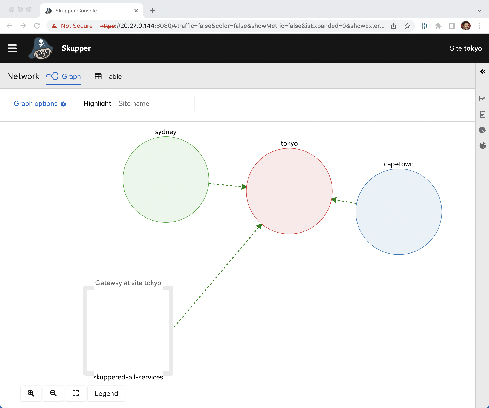
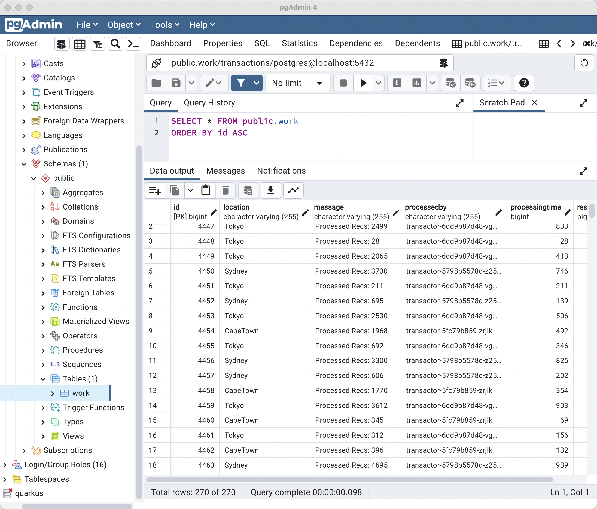
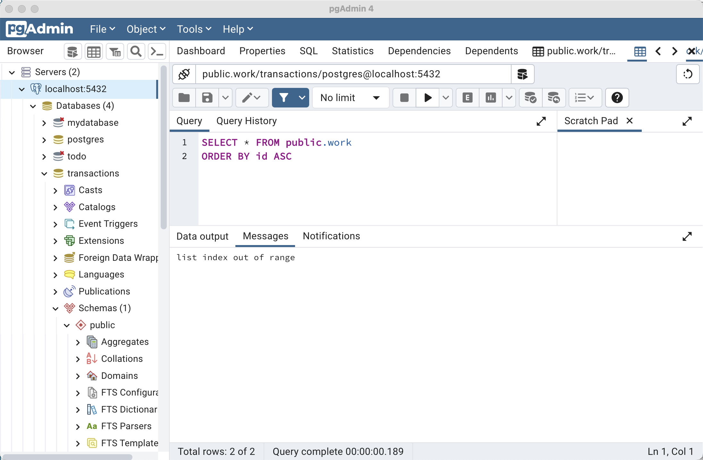
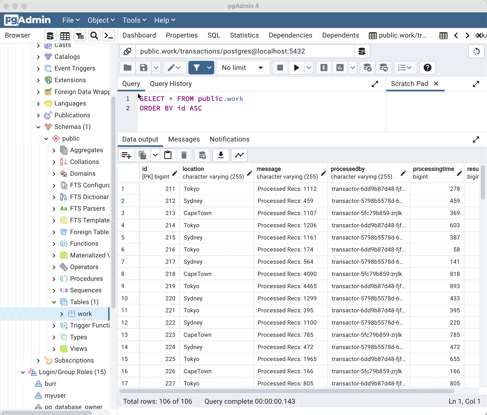

# Toyko, Cape Town and Sydney Kubernetes sharing on-premise RDBMS



Amazon, Google and Azure




## Create Cluster: Tokyo

```
export KUBECONFIG=/Users/burr/xKS/.kubeconfig/aks-tokyo-config

az login

az group create --name myAKSTokyoResourceGroup --location japaneast

az aks create --resource-group myAKSTokyoResourceGroup --name tokyo -s Standard_DS3_v2 --node-count 2
```

#### Update your KUBECONFIG

```
az aks get-credentials --resource-group myAKSTokyoResourceGroup --name tokyo --file $KUBECONFIG --overwrite
```

```
kubectl get nodes
NAME                                STATUS   ROLES   AGE     VERSION
aks-nodepool1-11151165-vmss000000   Ready    agent   7m32s   v1.22.11
aks-nodepool1-11151165-vmss000001   Ready    agent   7m30s   v1.22.11
```

#### Create Namespace

```
kubectl create namespace oltp
kubectl config set-context --current --namespace=oltp
```

#### Skupper ClI 

https://github.com/skupperproject/skupper/releases/

```
skupper version
client version                 1.0.2
```

#### Deploy Skupper

There is also a [Yaml way] (https://github.com/burrsutter/gke-skupper#yaml-way)and ArgoCD way [ArgoCD way] (https://github.com/burrsutter/gke-skupper#argocd-way) to deploy Skupper but for now I will use the CLI

https://github.com/burrsutter/gke-skupper


```
skupper init --site-name tokyo
```

```
kubectl get services
NAME                   TYPE           CLUSTER-IP    EXTERNAL-IP     PORT(S)                           AGE
skupper                LoadBalancer   10.0.50.0     20.27.186.231   8080:31618/TCP,8081:30211/TCP     97s
skupper-router         LoadBalancer   10.0.219.23   20.27.186.161   55671:32425/TCP,45671:32565/TCP   113s
skupper-router-local   ClusterIP      10.0.57.212   <none>          5671/TCP                          113s
```

```
kubectl get pods
NAME                                          READY   STATUS    RESTARTS   AGE
skupper-router-7f64947c99-qs987               2/2     Running   0          2m4s
skupper-service-controller-6458b58cc5-r2hwb   1/1     Running   0          98s
```

```
skupper status
```

```
Skupper is enabled for namespace "oltp" in interior mode. It is not connected to any other sites. It has no exposed services.
The site console url is:  https://20.27.186.231:8080
The credentials for internal console-auth mode are held in secret: 'skupper-console-users'
```

## Expose & map on-premises & cluster services

```
tokyo          on-premises 
----------     ----------------
oltp-rdbms  -> localhost:5432
on-prem-app -> localhost:8080
transactor  <- localhost:8081 
```

### Tokyo

#### Deploy the on-cluster application

```
kubectl apply -f transactor-deployment.yaml
```

```
kubectl get pods
NAME                                          READY   STATUS    RESTARTS     AGE
skupper-router-6fc4f4b9b9-tx5qw               2/2     Running   0            23m
skupper-service-controller-649d5f4665-dpwk8   1/1     Running   0            22m
transactor-75fd9b8bb7-fwj8k                   1/1     Running   1 (5s ago)   21s
```

Note: transactor will be crashlooping until we get the database stood up on-premises and wired up via Skupper

```
kubectl get services
NAME                   TYPE           CLUSTER-IP     EXTERNAL-IP   PORT(S)                           AGE
skupper                LoadBalancer   10.0.162.251   20.27.0.204   8080:30127/TCP,8081:32132/TCP     23m
skupper-router         LoadBalancer   10.0.65.161    20.27.0.141   55671:32747/TCP,45671:32761/TCP   23m
skupper-router-local   ClusterIP      10.0.2.253     <none>        5671/TCP                          23m
transactor             ClusterIP      10.0.97.89     <none>        8080/TCP                          33s
```

The service magically appears because of a special annotation

```
  annotations:
    skupper.io/proxy: "http"  
```

```
kubectl set env deployment/transactor LOCATION=Tokyo
```

Create proxy/skuppered services on Toyko (no pods, implemented on-premises)

```
skupper service create oltp-rdbms 5432
skupper service create on-prem-app 8080 --mapping http
```

```
kubectl get services
NAME                   TYPE           CLUSTER-IP     EXTERNAL-IP   PORT(S)                           AGE
oltp-rdbms             ClusterIP      10.0.37.88     <none>        5432/TCP                          14s
on-prem-app            ClusterIP      10.0.138.239   <none>        8080/TCP                          10s
skupper                LoadBalancer   10.0.162.251   20.27.0.204   8080:30127/TCP,8081:32132/TCP     60m
skupper-router         LoadBalancer   10.0.65.161    20.27.0.141   55671:32747/TCP,45671:32761/TCP   60m
skupper-router-local   ClusterIP      10.0.2.253     <none>        5671/TCP                          60m
transactor             ClusterIP      10.0.97.89     <none>        8080/TCP                          37m
```


## Expose on-premises/local services

```
docker ps
CONTAINER ID   IMAGE     COMMAND   CREATED   STATUS    PORTS     NAMES
```

Gateway launch on localhost/laptop

The use of Forwards involves the use of the Bundle

```
rm -rf bundle
rm -rf gateway
```

```
mkdir -p bundle/all-services
```

```
skupper gateway generate-bundle skuppered-all-services.yaml ./bundle/all-services
```

```
mkdir gateway

tar -xvf ./bundle/all-services/skuppered-all-services.tar.gz --directory gateway
```

Edit gatway/launch.sh, replacing `elif [ "$type" == "docker" ] || [ "$type" == "podman" ]; then`  at line 83 with contents of launch.sh from the root of this repo.


```
cp captureports.py ./gateway

cd gateway

chmod +x *.sh
```


```
./launch.sh -t docker
```

```
docker ps
CONTAINER ID   IMAGE                                  COMMAND                  CREATED         STATUS         PORTS                                                                                NAMES
da4847502fea   quay.io/skupper/skupper-router:2.0.2   "/home/skrouterd/bin…"   4 seconds ago   Up 3 seconds   0.0.0.0:5671-5672->5671-5672/tcp, 0.0.0.0:8081->8081/tcp, 0.0.0.0:55672->55672/tcp   skuppered-all-services
```

```
skupper status
Skupper is enabled for namespace "oltp" with site name "tokyo" in interior mode. It is connected to 1 other site. It has 3 exposed services.
The site console url is:  https://20.27.0.204:8080
The credentials for internal console-auth mode are held in secret: 'skupper-console-users'
```

```
skupper service status
Services exposed through Skupper:
├─ on-prem-app (http port 8080)
├─ transactor (http port 8080)
│  ╰─ Targets:
│     ╰─ app=transactor name=transactor
╰─ oltp-rdbms (tcp port 5432)
```

Start the localhost/on-premises PostgreSQL.  I am using PostgreSQL 14 https://www.postgresql.org/download/macosx/ and pgAdmin4 https://www.pgadmin.org/download/




Test the remote/forwarded transactor service

```
curl localhost:8081
Tokyo needs a number
```

Start the localhost/on-premises transactor

```
cd transaction
export HOSTNAME="localhost"
export LOCATION="on-premises"

mvn quarkus:dev
```

```
curl localhost:8080
on-premises needs a number
```


## On Cluster Tests

Using the Skupper Router pod but any pod should work as they all have visbility to Kubernetes Services in this hybrid namespace.

```
kubectl exec -it deploy/skupper-router -c router -- bash
```

```
curl on-prem-app:8080
on-premises needs a number
```

```
curl on-prem-app:8080/2
Jobs: 2
```

And check your local database


drop out of the exec

```
exit
```

Test the database

```
kubectl apply -f psql-client-deployment.yaml
```

```
kubectl exec -it deploy/psql -- sh
```

```
psql
\l
\dt
select * from work;
```

```
 id |  location   |       message        | processedby | processingtime | result
----+-------------+----------------------+-------------+----------------+--------
  1 | on-premises | Processed Recs: 1154 | localhost   |            577 |   3432
  2 | on-premises | Processed Recs: 1730 | localhost   |            865 |   5172
```


To drop out of the exec

```
quit
exit
```

```
kubectl exec -it deploy/transactor -- bash 
```

```
curl localhost:8080/2
```


```
exit
```

### Console: Tokyo

hostname for AWS, ip for others

```
CONSOLETOKYO=$(kubectl get service skupper -o jsonpath="{.status.loadBalancer.ingress[0].ip}"):8080
echo $CONSOLETOKYO
```

Password

```
CONSOLEPASSWORDTOKYO=$(kubectl get secret skupper-console-users -o jsonpath='{.data.admin}' | base64 -d)
echo $CONSOLEPASSWORDTOKYO
```

```
open https://$CONSOLETOKYO
```

Login with `admin` and $CONSOLEPASSWORDTOKYO


## Load Generator

```
cd load-gen
mvn quarkus:dev
```

To start the load generation

```
curl localhost:8082/sendload/10
```

To stop the load generation

```
curl localhost:8082/sendload/0
```

```
select * from work;
```


## Create Cluster: CapeTown

```
export KUBECONFIG=/Users/burr/xKS/.kubeconfig/capetown-config

eksctl create cluster \
--name capetown \
--region af-south-1 \
--nodegroup-name myEKSworkers \
--instance-types=m5.xlarge \
--nodes 2 \
--managed
```

```
eksctl utils write-kubeconfig --cluster=capetown --region=af-south-1

aws eks update-kubeconfig --name=capetown --region=af-south-1
```

```
kubectl create namespace oltp
kubectl config set-context --current --namespace=oltp
```

```
skupper init --site-name capetown
```

#### On Toyko

```
skupper token create token.yaml -t cert
```

#### On CapeTown

```
skupper link create token.yaml
```

```
skupper status
Skupper is enabled for namespace "oltp" with site name "capetown" in interior mode. It is connected to 2 other sites (1 indirectly). It has 3 exposed services.
The site console url is:  https://a807235ccf1bd47d995a949075282fb0-1876990102.af-south-1.elb.amazonaws.com:8080
The credentials for internal console-auth mode are held in secret: 'skupper-console-users'
```

```
kubectl get services
```

```
NAME                   TYPE           CLUSTER-IP       EXTERNAL-IP                                                                PORT(S)                           AGE
oltp-rdbms             ClusterIP      10.100.184.60    <none>                                                                     5432/TCP                          43s
on-prem-app            ClusterIP      10.100.169.73    <none>                                                                     8080/TCP                          43s
skupper                LoadBalancer   10.100.19.144    a807235ccf1bd47d995a949075282fb0-1876990102.af-south-1.elb.amazonaws.com   8080:30052/TCP,8081:31382/TCP     9m47s
skupper-router         LoadBalancer   10.100.89.109    a0f1a84befd814eccb919848d1d7493c-1233493713.af-south-1.elb.amazonaws.com   55671:32430/TCP,45671:30105/TCP   9m53s
skupper-router-local   ClusterIP      10.100.104.89    <none>                                                                     5671/TCP                          9m53s
transactor             ClusterIP      10.100.193.245   <none>                                                                     8080/TCP                          43s
```

```
skupper service status
Services exposed through Skupper:
├─ oltp-rdbms (tcp port 5432)
├─ on-prem-app (http port 8080)
╰─ transactor (http port 8080)
```

```
kubectl apply -f transactor-deployment.yaml
```

```
kubectl set env deployment/transactor LOCATION=CapeTown
```

```
skupper service status
Services exposed through Skupper:
├─ transactor (http port 8080)
│  ╰─ Targets:
│     ╰─ app=transactor name=transactor
├─ oltp-rdbms (tcp port 5432)
╰─ on-prem-app (http port 8080)
```

```
kubectl exec -it deploy/transactor -- bash 
```

```
curl localhost:8080/2
```


Note: to wipe out all records on the central database

```
curl localhost:8080/delete
```


### Console: Cape Town

hostname for AWS, ip for others

```
CONSOLECAPETOWN=$(kubectl get service skupper -o jsonpath="{.status.loadBalancer.ingress[0].hostname}"):8080
```

Password

```
CONSOLEPASSWORDCAPETOWN=$(kubectl get secret skupper-console-users -o jsonpath='{.data.admin}' | base64 -d)
```

```
open https://$CONSOLECAPETOWN
```

Login with `admin` and $CONSOLEPASSWORDCAPETOWN


## Fail-over

### Tokyo

```
kubectl scale --replicas=0 deployment/transactor
```

Send some load

```
curl localhost:8082/sendload/10
```

Stop the load
```
curl localhost:8082/sendload/0
```


## Create Cluster: Sydney

```
export KUBECONFIG=/Users/burr/xKS/.kubeconfig/sydney-config

gcloud container clusters create sydney --zone australia-southeast1 --num-nodes 1 --machine-type e2-standard-4

gcloud container clusters get-credentials sydney --zone australia-southeast1 
```

```
kubectl create namespace oltp
kubectl config set-context --current --namespace=oltp
```

```
skupper init --site-name sydney
```

```
skupper status
Skupper is enabled for namespace "oltp" with site name "sydney" in interior mode. It is not connected to any other sites. It has no exposed services.
The site console url is:  https://35.244.77.35:8080
The credentials for internal console-auth mode are held in secret: 'skupper-console-users'
```

```
skupper service status
No services defined
```

Connect it to Tokyo

```
skupper link create token.yaml
```


```
skupper service status
Services exposed through Skupper:
├─ on-prem-app (http port 8080)
├─ transactor (http port 8080)
╰─ oltp-rdbms (tcp port 5432)
```

```
kubectl apply -f transactor-deployment.yaml
```

```
skupper service status
Services exposed through Skupper:
├─ oltp-rdbms (tcp port 5432)
├─ on-prem-app (http port 8080)
╰─ transactor (http port 8080)
   ╰─ Targets:
      ╰─ app=transactor name=transactor
```

```
kubectl set env deployment/transactor LOCATION=Sydney
```

```
kubectl exec -it deploy/transactor -- bash 
```

```
curl localhost:8080/2
```


```
exit
```

### Console: Sydney

hostname for AWS, ip for others

```
CONSOLESYDNEY=$(kubectl get service skupper -o jsonpath="{.status.loadBalancer.ingress[0].ip}"):8080
```

Password

```
CONSOLEPASSWORDSYDNEY=$(kubectl get secret skupper-console-users -o jsonpath='{.data.admin}' | base64 -d)
echo $CONSOLEPASSWORDSYDNEY
```

```
open https://$CONSOLESYDNEY
```

Login with `admin` and $CONSOLEPASSWORDCAPETOWN


## Load Generator

```
 curl localhost:8081/delete
```

Start load

```
curl localhost:8082/sendload/10
```

currency of `10` to see the load-balancing


Stop load
```
curl localhost:8082/sendload/0
```



## Clean up

```
./gateway/remove.sh
```

```
docker ps
CONTAINER ID   IMAGE     COMMAND   CREATED   STATUS    PORTS     NAMES
```

```
gcloud container clusters delete sydney --zone australia-southeast1
```

```
eksctl delete cluster --name capetown --region af-south-1
```

```
az aks delete --resource-group myAKSTokyoResourceGroup --name tokyo
```

```
gcloud container clusters list
```

```
eksctl get cluster --region af-south-1
```

```
az aks list --resource-group myAKSTokyoResourceGroup
```

https://www.screencast.com/t/ocP2Gy7Y


# Forwards Testing

https://skupper.netlify.app/skupper/latest/cli/index.html#gateway-reference

https://access.redhat.com/documentation/en-us/red_hat_application_interconnect/1.0/html/using_the_application_interconnect_cli/exposing-services-local#exporting-gateway


```
export KUBECONFIG=/Users/burr/xKS/.kubeconfig/aks-tokyo-config

az login

az group create --name myAKSTokyoResourceGroup --location japaneast

az aks create --resource-group myAKSTokyoResourceGroup --name tokyo -s Standard_DS3_v2 --node-count 2
```


```
az aks get-credentials --resource-group myAKSTokyoResourceGroup --name tokyo --file $KUBECONFIG --overwrite
```

```
kubectl create namespace oltp
kubectl config set-context --current --namespace=oltp
```

```
skupper init --site-name tokyo
```


```
kubectl apply -f forwarded-deployment.yaml
```

```
docker ps
CONTAINER ID   IMAGE     COMMAND   CREATED   STATUS    PORTS     NAMES
```

The use of Forwards involves the use of the Bundle

```
rm -rf bundle
rm -rf gateway
```

```
mkdir -p bundle/forwarded-services
```

```
skupper gateway generate-bundle skuppered-forwarded-services.yaml ./bundle/forwarded-services
```

```
mkdir gateway

tar -xvf ./bundle/forwarded-services/skuppered-forwarded-services.tar.gz --directory gateway
```

Edit gatway/launch.sh, replacing `elif [ "$type" == "docker" ] || [ "$type" == "podman" ]; then`  at line 83 with contents of launch.sh from the root of this repo.


```
cp captureports.py ./gateway

cd gateway

chmod +x *.sh
```


```
./launch.sh -t docker
```

```
docker ps
```

```
CONTAINER ID   IMAGE                                  COMMAND                  CREATED         STATUS         PORTS                                                                                NAMES
1891ce652685   quay.io/skupper/skupper-router:2.0.2   "/home/skrouterd/bin…"   3 seconds ago   Up 2 seconds   0.0.0.0:5671-5672->5671-5672/tcp, 0.0.0.0:8081->8081/tcp, 0.0.0.0:55672->55672/tcp   skuppered-forwarded-services
```

```
curl localhost:8081
```

```
Default via Quarkus 1 on hello-6d7ffb887f-r26mp
```


To clean up, `./remove.sh`


```
az aks delete --resource-group myAKSTokyoResourceGroup --name tokyo
```